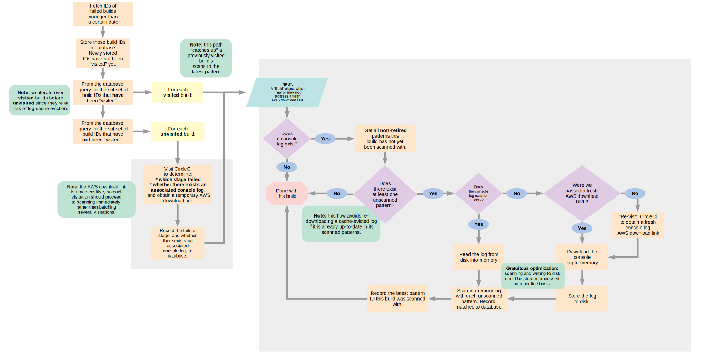

- 

# A log analyzer for CircleCI

An organization would like to determine what the most common causes of intermittent build
failures/flaky tests are in the a repository so that effort can be prioritized
to fix them.

This tool obtains a list of CircleCI builds run against a GitHub repository for
a master branch, downloads their logs (stripped of ANSI escape codes) from AWS, and scans the logs for a
predefined list of labeled patterns (regular expressions).

These patterns are curated by an operator.  The frequency of occurrence of each
pattern are tracked and presented in a web UI.

The database tracks which builds have been already scanned for a given pattern,
so that scanning may be performed incrementally or resumed after abort.

## Tool workflow

* A webhook listens for build status changes on a GitHub PR
* For each failed build, that build's log will be scanned for any of the patterns in the database tagged as "flaky"
* The tool will automatically post one more status (atop the 75 or so current statuses) that says how many of the failures were flaky.
* If all of the failures were flaky, the indicator will be green.  There will be a link in the status box to dive into the details.
* likewise for failures marked with my tool as "known problems"

# Known Problem reporting

Requiring that failures in the master branch be annotated will facilitate tracking of the frequency of "brokenness" of master over time, and allow measurement of whether this metric is improving.

It is possible for only specific jobs of a commit to be marked as "known broken", e.g. the Travis CI Lint job.

## Log scanning data flow diagram

Deployment
-------------

### AWS dependencies

See: [docs/aws](docs/aws)

### Ingestion overview

1. A small webservice (named `gh-notification-ingest-env` in Elastic Beanstalk, and hosted at domain `github-notifications-ingest.pytorch.org`) receives GitHub webhook notifications and stores them (synchronously) in a database.
2. A periodic (3-minute interval) AWS Lambda task `EnqueSQSBuildScansFunction` queries for unprocessed notifications in the database, and enqueues an SQS message for each of them.
3. Finally, an Elastic Beanstalk Worker-tier server named `log-scanning-worker` process the SQS messages as capacity allows.

We want a cool-off period during which multiple builds for a given commit can be aggregated into one task for that commit.
This is accomplished via an SQS deduplicating queue, where multiple instances of the same commit are consolidated while in the queue.

Optimizations
-------------

* We can skip inspecting *all* of the "previously-visited" builds if the master "scan" record points to the newest pattern ID.
    * Better yet, use a single DB query to get the list of out-of-date "already-visited" builds, instead of a separate query per build to obtain the unscanned pattern list.

## Features

* Periodically fetches builds directly from CircleCI API to catch up on GitHub notifications that may have been dropped

## Source attribution

Aho-Corasick implementation is from here: https://github.com/channable/alfred-margaret
